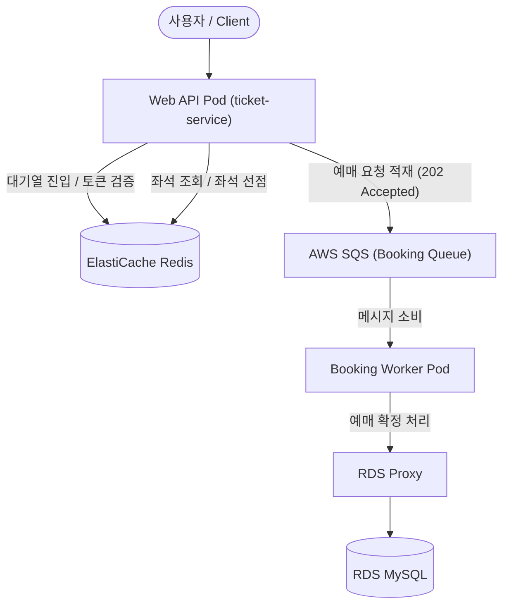

# Ticket Wave — APP
### EKS 기반 고가용성 티켓팅 서비스

> 이 저장소는 멋쟁이사자처럼 AWS 기반 DevOps 엔지니어 과정 팀 프로젝트(5인)의 fork 입니다.  
> 본 README는 담당 영역을 중심으로 재작성했습니다.  

 

원본 저장소
* **App 레포** : [team5-ticket-app](https://github.com/CLD-05/team5-ticket-app)
* **Config 레포** : [team5-ticket-config](https://github.com/CLD-05/team5-ticket-config)
* **Infra 레포** : [team5-ticket-infra](https://github.com/CLD-05/team5-ticket-infra)  

 

## 프로젝트 개요

예매 오픈 시점에 트래픽이 순간적으로 집중되는 티켓팅 서비스 특성상, 

단순 서버 배포가 아니라 트래픽 완충·비동기 처리·데이터 정합성·오토스케일링·운영 관측성을 함께 고려한 인프라가 필요했습니다. 

이를 EKS 기반으로 구축하고, dev/prod 환경을 분리해 Terraform으로 관리했습니다.

- 기간 : 2026.06.02 ~ 2026.07.08
- 팀 구성 : 5인
- 담당 : EKS 접근 통제 체계 구축 · 실시간 좌석 API 개발

 

## 시스템 아키텍처 및 비동기 처리 흐름

 

## 내가 담당한 부분

### 좌석 선점 동시성 처리

 

**[EKS 접근 통제 체계 구축](https://github.com/its-jihyeon/ticket-wave-infra/blob/main/README.md)**

 

## 기술 스택
AWS (EKS, RDS, IAM, SSM) · Terraform · Redis · Java

